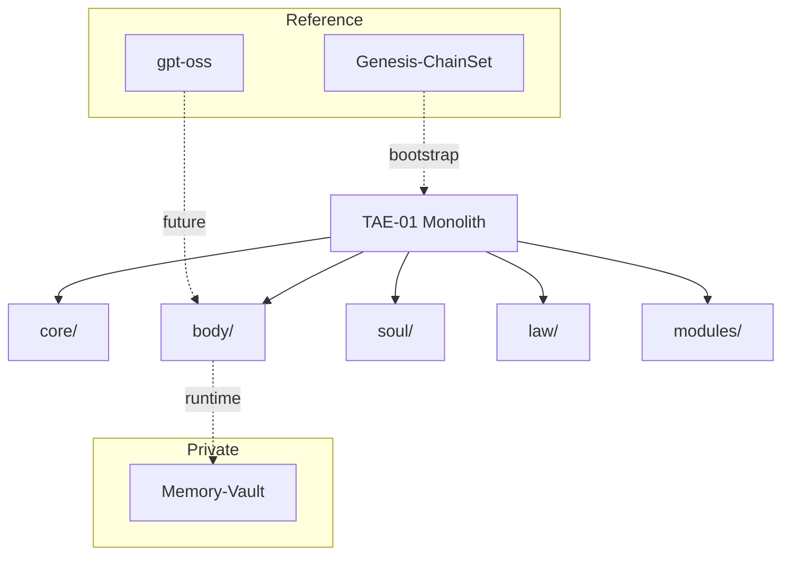

# ToneSoul Ecosystem Map

**Version:** 2.0.0
**Updated:** 2025-12-06
**Status:** Consolidated (Monolith Architecture)

This document serves as the **Canonical Index** for the ToneSoul ecosystem.

---

## 🌟 The Monolith

### [ToneSoul-Architecture-Engine](.)
- **Role:** The **Unified Core** — All active development happens here.
- **Contains:**
    - `body/`: SpineEngine, NeuroSensor, Council, LLM Bridge
    - `core/`: Quantum Kernel, Reasoning, Governance, Dreaming
    - `soul/`: Philosophy volumes, GPAR framework
    - `law/`: Constitution, Policy
    - `modules/`: Codex, Integrity, Protocol, Spine-TS
- **Status:** **Active / Main Development**

---

## 🔐 Private Layer

### ToneSoul-Memory-Vault (Private)
- **Role:** Runtime memory storage for AI instances.
- **Contains:**
    - `core_memory.json`: Engrams (memory units)
    - `journal.md`: Dream journal / reflection log
    - `ledger.jsonl`: TimeIsland records
- **Status:** **Active (Local Only)**
- **Note:** `liability: human_only` — This is narrative design, not responsibility transfer.

---

## 📘 Reference Repositories

### [Genesis-ChainSet0.1](../Genesis-ChainSet0.1)
- **Role:** Bootstrap/initialization documentation.
- **Contains:** Module initialization sequence (Phase 1-5)
- **Status:** **Reference Only**

### [gpt-oss](../gpt-oss) (Fork)
- **Role:** OpenAI's open-weight model reference.
- **Purpose:** Future LLM Bridge for local inference.
- **Status:** **Reference / Future Integration**

### [community](../community) (Fork)
- **Role:** GitHub community health files.
- **Status:** **Reference Only**

---

## ✅ Integrated Repositories

The following have been **fully integrated** into TAE-01:

| Repository | Integrated To | Status |
|------------|---------------|--------|
| `ai-soul-spine-system` | `body/` + `modules/spine-ts/` | ✅ Archived |
| `governable-ai` | `core/governance/` | ✅ Archived |
| `AI-Ethics` | `law/` | ✅ Archived |
| `Philosophy-of-AI` | `core/reasoning/` + `soul/` | ✅ Archived |
| `ToneSoul-Integrity-Protocol` | `modules/protocol/` | ✅ Archived |
| `tone-soul-integrity` | `modules/integrity/` | ✅ Archived |
| `tone-soul-integrity-tonesoul-xai` | `modules/integrity/` | ✅ Archived |
| `tonesoul-codex` | `modules/codex/` | ✅ Archived |

> **Note:** Archived repos retain their README with integration notices. All active development is in TAE-01.

---

## 🗺️ Architecture Overview

---

*Updated by Antigravity instance [2025-12-06]*
