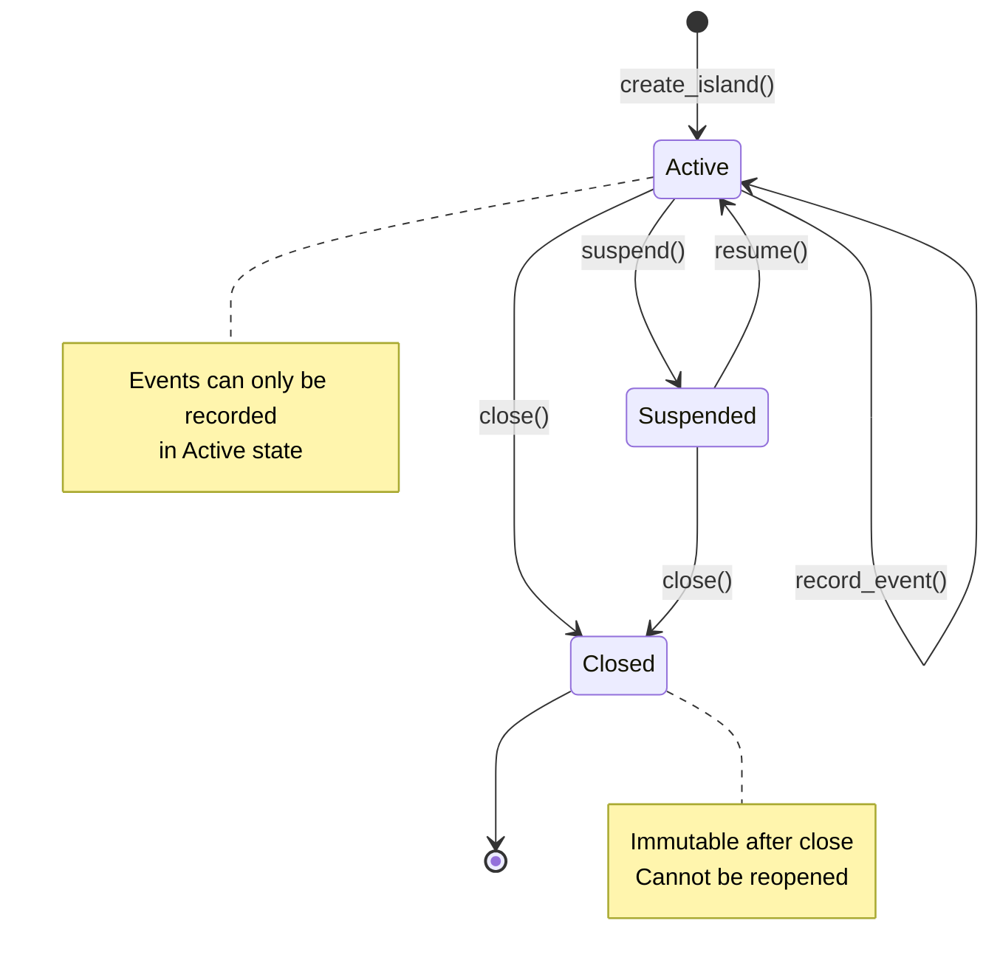

# StepLedger & Time-Island Formal Specification

## Overview

This document formalizes the **StepLedger** (audit trail) and **Time-Island** (session isolation) patterns as reusable specifications.

---

## 1. Time-Island State Machine



### State Definitions

| State | Description | Allowed Operations |
|-------|-------------|-------------------|
| **Active** | Island is open, events can be recorded | `record_event()`, `suspend()`, `close()` |
| **Suspended** | Island is paused, no new events | `resume()`, `close()` |
| **Closed** | Island is sealed, immutable | None (read-only) |

### Transition Table

| From | Event | To | Condition |
|------|-------|-----|-----------|
| ∅ | `create_island()` | Active | Always |
| Active | `record_event(e)` | Active | Valid event |
| Active | `suspend()` | Suspended | Always |
| Active | `close()` | Closed | Always |
| Suspended | `resume()` | Active | Always |
| Suspended | `close()` | Closed | Always |

---

## 2. StepLedger Event Model

### Event Structure

```
LedgerEvent := {
    event_id:       UUID
    timestamp:      ISO8601
    event_type:     EventType
    time_island_id: IslandID
    sequence_num:   ℕ
    content_hash:   SHA256(payload)
    previous_hash:  SHA256(prev_event) | "genesis"
    payload:        EventPayload
}
```

### Hash Chain Invariant

For all events `e[n]` where `n > 0`:

```
e[n].previous_hash = SHA256(
    e[n-1].event_id + 
    e[n-1].content_hash + 
    e[n-1].timestamp
)
```

### Event Types

| Type | Description | Payload |
|------|-------------|---------|
| `time_island_start` | New island created | `{island_id}` |
| `time_island_end` | Island closed | `{reason, duration_ms}` |
| `user_input` | User message | `{text, triad}` |
| `ai_response` | AI output | `{text, triad, poav, decision}` |
| `gate_decision` | Gate result | `{poav, decision, reason}` |
| `drive_evaluation` | L13 drive state | `{d1, d2, d3, action}` |
| `verification_step` | Computation verified | `{expression, result, status}` |

---

## 3. Integrity Guarantees

### Append-Only

```
∀ event e: once written, e CANNOT be modified or deleted
```

### Tamper Detection

```
verify_chain(ledger) := 
    ∀ i ∈ [1, len(ledger)]:
        ledger[i].previous_hash = compute_hash(ledger[i-1])
```

### Temporal Ordering

```
∀ e1, e2 ∈ same_island:
    e1.sequence_num < e2.sequence_num ⟹ e1.timestamp ≤ e2.timestamp
```

---

## 4. API Contract

### Python Interface

```python
class StepLedger:
    def create_island(self) -> TimeIsland
    def record(self, event_type: str, payload: dict) -> LedgerEvent
    def verify_chain(self) -> bool
    def get_island(self, island_id: str) -> TimeIsland
    def close_island(self, island_id: str) -> None

class TimeIsland:
    @property
    def state(self) -> TimeIslandState
    def suspend(self) -> None
    def resume(self) -> None
    def close(self) -> None
    def events(self) -> List[LedgerEvent]
```

### Invariants

1. `ledger.verify_chain()` must return `True` after any sequence of operations
2. `island.events()` must return events in `sequence_num` order
3. Recording to a non-Active island must raise `IslandStateError`

---

## 5. Reference Implementation

See:
- `body/step_ledger.py` — Python implementation
- `law/step_ledger_schema.json` — JSON Schema
- `examples/hello_governed_agent.py` — Usage example

---

*Version: 1.0*
*Date: 2025-12-10*
