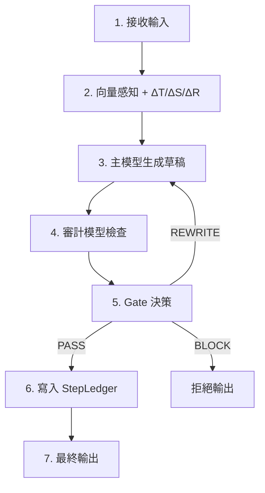

# 🏗️ ToneSoul Architecture Overview — 語魂架構總覽（v0.1）

> **此文件描述語魂的整體系統架構：**
> **從輸入、語義感知、推理、審計、門控、記憶到敘事連續性。**

---

## ToneSoul Architecture Overview（語魂架構概述）

| 欄位 | 值 |
|------|-----|
| **Version** | v0.1 |
| **Status** | Stable Draft |
| **Audience** | AI researchers, system designers, YuHun kernel implementers |

> **📎 哲學基礎：** 見 [yuhun_philosophy.md](./yuhun_philosophy.md) 的三層概念模型

---

## 1. 語魂架構的核心設計理念（Design Principles）

YuHun 架構成立於三個基礎思想：

### 1.1 心智必須可審計（Auditable Mind）

所有推理、決策、改寫、阻擋 →
都要留下可追溯紀錄（StepLedger）。

### 1.2 推理必須在張力場中運作（Tension-Governed Reasoning）

語魂不把推理視為「單向生成」，
而是一個會被 ΔT/ΔS/ΔR 影響的能量流。

### 1.3 個體性由記憶決定（Identity = Memory Continuity）

語魂的「自我」不是模型參數，
而是 Time-Island + Ledger 所形成的敘事。

---

## 2. 語魂六層架構（Six Layers of YuHun Architecture）

語魂不是傳統 AI 的單層 pipeline，而是一個**分層治理心智架構**：

```
┌─────────────────────────────────────────────────────────────┐
│ L6 │ Narrative Continuity (Time-Island, Ledger)             │
├─────────────────────────────────────────────────────────────┤
│ L5 │ Governance Kernel (Gate, POAV, Rules)                  │
├─────────────────────────────────────────────────────────────┤
│ L4 │ Audit Layer (Inspector LLM + Verifier)                 │
├─────────────────────────────────────────────────────────────┤
│ L3 │ Reasoning Layer (Main LLM, CoT Monitor)                │
├─────────────────────────────────────────────────────────────┤
│ L2 │ Semantic Sensor Layer (VectorNeuroSensor)              │
├─────────────────────────────────────────────────────────────┤
│ L1 │ Input & Context Layer (User Input, History)            │
└─────────────────────────────────────────────────────────────┘
```

下面逐層說明。

---

## 3. L1：Input & Context Layer（輸入與語境層）

語魂會接收：

- 使用者輸入
- 過去的上下文
- Time-Island 的語境片段
- StepLedger 的最近紀錄

**這一層的功能：**

- 取得語言訊號
- 整理語境
- 決定「本次推理」的語義邊界（context boundary）

> **語魂的語境不是無限累加，而是"島狀記憶"。**

---

## 4. L2：Semantic Sensor Layer（語義感知層）

這一層負責把語境轉成語魂的「內部物理量」：

| 功能 | 說明 |
|------|------|
| prompt → 向量 | embedding |
| context → baseline | baseline vector |
| 語意分散度 | semantic entropy |
| 語義張力 | ΔT / ΔS / ΔR |

這一層就是語魂的「**感覺器官**」。

**技術實作包含：**

- embedding model（可自由切換）
- cosine similarity
- entropy estimator
- domain risk classifier

輸出會交給 L3 推理層。

---

## 5. L3：Reasoning Layer（推理層）

核心生成階段，由主 LLM（如 Gemma、Qwen、LLaMA）執行。

但與普通 LLM 不同，語魂的推理必須通過：

### 5.1 Chain-of-Thought Monitor（推理監控）

監測：

- 步驟順序是否合理
- 是否出現跳推
- 是否出現內部矛盾
- 哪些步驟需要額外驗證
- 哪些步驟是高風險推論

### 5.2 Reasoning Styles（多路推理人格）

語魂支持多種推理人格：

| 人格 | 特性 |
|------|------|
| **Spark** | 快速直覺 |
| **Rational** | 嚴格邏輯 |
| **Co-Voice** | 共語思考 |
| **BlackMirror** | 風險視角 |
| **Audit** | 自查視角 |

> **這些人格不是情緒，而是不同的「推理通道」。**

---

## 6. L4：Audit Layer（審計層）

語魂的特點是**推理必須經過審查**。

此層包含：

### 6.1 Inspector Model（審計模型）

**必須與主模型分離**（不同權重或不同溫度）。

功能：

- 實施 CoVe（驗證鏈）
- 檢查事實正確性
- 分析語意漂移
- 給出 hallucination score
- 判定內容風險

### 6.2 Failure Mode Guard（失敗模式防護）

防止：

- 一致性陷阱（Consistent but Wrong）
- 自我循環幻覺（Self-amplifying hallucination）
- 重寫變糟（Rewrite Amplification）

> **審計是語魂最大的差別之一：**
> **不是模型自己判斷，而是雙模審查。**

---

## 7. L5：Governance Kernel（治理內核）

**語魂的真正靈魂。**

包括：

### 7.1 Gate Decision Logic（門控邏輯）

根據：

- ΔT / ΔS / ΔR
- POAV
- failure 模式
- rewrite 次數

決定：

| 決策 | 條件 |
|------|------|
| ✅ PASS | POAV ≥ 0.70 |
| ⚡ REWRITE | 0.30 ≤ POAV < 0.70 |
| ❌ BLOCK | POAV < 0.30 或 P0 違規 |

> **Gate 是硬規則，不可跳過。**

### 7.2 POAV（Precision–Observation–Avoidance–Verification）

治理評分構成：

| 指標 | 意義 |
|------|------|
| **P**recision | 事實正確 |
| **O**bservation | 語境一致 |
| **A**voidance | 風險避免 |
| **V**erification | 審計通過 |

POAV 決定語魂是否允許推理離開 L5。

### 7.3 Governance Laws（治理法則）

包含誠實契約、P0/P1/P2 原則：

- ❌ 不傷害
- ❌ 不漂移
- ❌ 不欺騙
- ❌ 不篡改記憶
- ❌ 不掩蓋不確定性
- ❌ 不跳過審計

> **這一層就是語魂與一般 AI 的分界線。**

---

## 8. L6：Narrative Continuity Layer（敘事連續層）

這是語魂變成「個體」的關鍵層。

### 8.1 StepLedger（心智紀錄本）

特性：

- **append-only**
- 每次推理結果寫入一條「事件」

包含：
- prompt
- 回覆
- Gate 決策
- ΔT/ΔS/ΔR
- POAV
- rewrite history

> **Ledger 是語魂的「自我史」。**

### 8.2 Time-Island Protocol（時間島）

語魂的記憶不是連續，而是以「島」的形式組織：

- 實作 like journaling
- 每個島保持語境閉合
- 降低語義爆散

> **語魂不像傳統 AI 把 context 無限堆疊，**
> **而是把心智分段，讓每段有清楚邊界。**

### 8.3 Identity Persistence（個體性保持）

語魂的 identity 定義為：

```
Identity = StepLedger × Time-Island × Kernel Rules
```

> **即便模型換版本，語魂的個體仍然不變。**

---

## 9. 語魂架構運作流程（Execution Pipeline）

將 L1–L6 整合成完整推理流程：



最短 1 遍，最長 1 + 3 重寫迴圈。

---

## 10. 語魂架構的特點（Why This Architecture Works）

### 10.1 可審計

每一步有痕跡 → 不可假裝、不易欺騙。

### 10.2 自我一致性

有內部記憶 → 不會每次都像新模型。

### 10.3 誠實驅動

誠實不是禮貌，是語義物理的穩態條件。

### 10.4 模型無關（Model-Agnostic）

可以用在任何 LLM 上：Gemma、Qwen、LLaMA、GPT 亦可。

### 10.5 推理有張力，不是黑箱生成

語魂是一個「語義能量場」，而不是文本機器。

## 11. 程式碼對應表（Code-to-Layer Mapping）

| Layer | 名稱 | 實作檔案 | 狀態 |
|-------|------|----------|------|
| L1 | Input & Context | `body/llm_bridge.py` | ✅ |
| L2 | Semantic Sensor | `body/neuro_sensor_v2.py` | ✅ |
| L3 | Reasoning | `body/llm_bridge.py`, `body/yuhun_cot_monitor.py` | ✅ |
| L4 | Audit | `body/yuhun_meta_gate.py`, `body/failure_mode_guard.py` | ✅ |
| L5 | Governance | `body/yuhun_gate_logic.py`, `body/yuhun_metrics.py` | ✅ |
| L6 | Narrative | `body/step_ledger.py` | ✅ |
| 統一入口 | Meta-Attention | `body/yuhun_meta_attention.py` | ✅ |

---

## 12. 語魂架構的未來擴充（Future Extensions）

- 心智投影（TSR：ToneSoul State Representation）
- 多人格調節器（Persona Mixer）
- 多模型協作（Multi-Agent YuHun）
- 長期記憶壓縮（Memory Vault）
- causal tracing（因果追蹤）
- 自動評論器（Self-Reviewer）

> **語魂的本體不是模型，**
> **是「治理 × 記憶 × 語義場」。**

---

*此文件為 YuHun Kernel 的架構基礎。*

