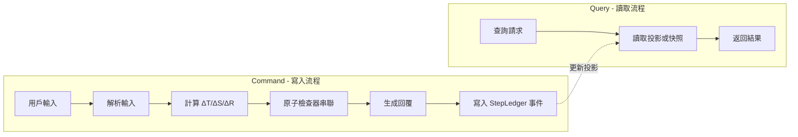

# CQRS × 語魂流程圖

此圖呈現 Command/Query 責任分離在語魂系統中的實際流程。

```mermaid
flowchart LR
    subgraph CommandPath ["Command - 寫入流程"]
        A1[用戶輸入] --> B1[解析輸入]
        B1 --> C1["計算 ΔT/ΔS/ΔR"]
        C1 --> D1[原子檢查器串聯]
        D1 --> E1[生成回覆]
        E1 --> F1[寫入 StepLedger 事件]
    end

    subgraph QueryPath ["Query - 讀取流程"]
        A2[查詢請求] --> B2[讀取投影或快照]
        B2 --> C2[返回結果]
    end

    F1 -. 更新投影 .-> B2
```

Command 路徑負責處理輸入、計算向量、執行檢查器並更新 StepLedger；Query 路徑則從已生成的投影讀取資料，兩者之間的依賴僅透過事件和投影更新。
