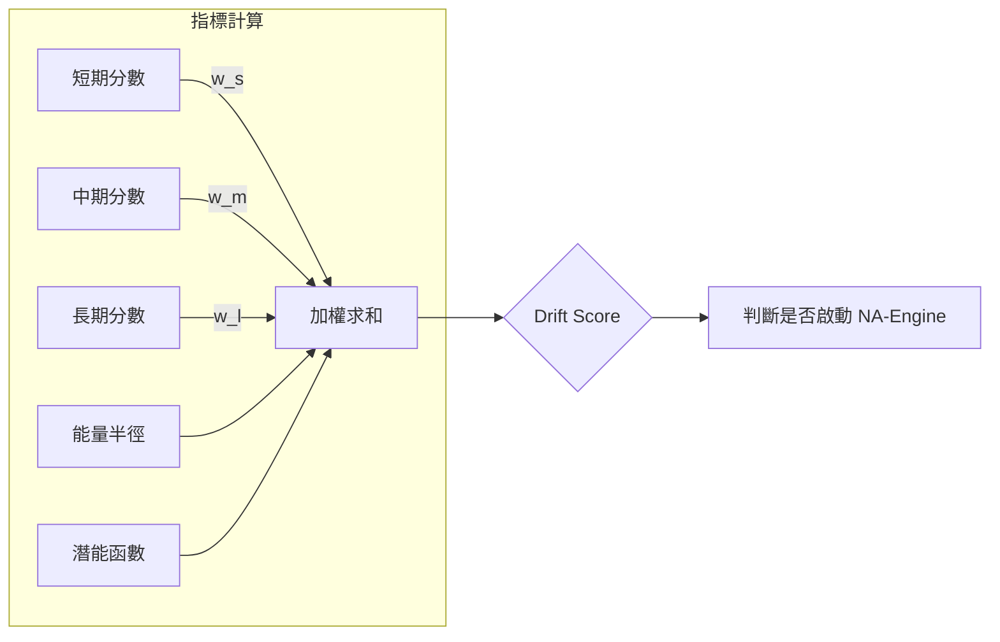

# Drift Score 5.0 視覺化

以下使用 Mermaid 顯示計算 Drift Score 的各項元素及其組合方式。

```mermaid
graph LR
    subgraph Metrics[指標計算]
        A[短期分數] -- w_s --> D[加權求和]
        B[中期分數] -- w_m --> D
        C[長期分數] -- w_l --> D
        E[能量半徑] --> D
        F[潛能函數] --> D
    end
    D --> G{Drift Score}
    G --> H[判斷是否啟動 NA‑Engine]
```

本圖表示短、中、長期分數與能量、潛能等指標經加權後生成最終 Drift Score，再根據閾值決定是否啟動 NA‑Engine 進行修正。