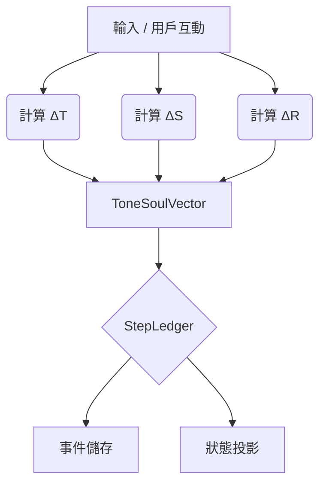

# 三向量結構圖

以下使用 Mermaid 語法描述語魂系統中三向量 ΔT/ΔS/ΔR 之間的關係。您可以使用兼容 Mermaid 的渲染器（如 VS Code、GitHub 或線上工具）查看此圖。

```mermaid
graph TD
    A[輸入 / 用戶互動] --> B(計算 ΔT)
    A --> C(計算 ΔS)
    A --> D(計算 ΔR)
    B --> E[ToneSoulVector]
    C --> E
    D --> E
    E --> F{StepLedger}
    F --> G[事件儲存]
    F --> H[狀態投影]
```

圖中展示了用戶輸入經過三項指標計算後生成 `ToneSoulVector`，並將結果寫入 StepLedger 以供後續投影與審計使用。